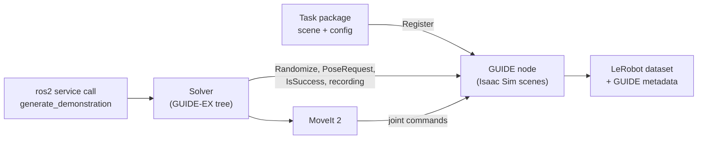

# GUIDE Framework


[](https://www.gnu.org/licenses/gpl-3.0)
[](https://docs.ros.org/en/jazzy/)
[](https://docs.isaacsim.omniverse.nvidia.com/latest/index.html)
[](https://www.python.org/)
[](https://moveit.picknik.ai/main/index.html)
[](https://github.com/huggingface/lerobot)
[](https://doi.org/10.1109/SISY67000.2025.11205394)


## Introduction
The **GUIDE** framework is a modular, scalable, and task-agnostic imitation learning framework for robotics. It interfaces **Isaac Sim** with *ROS 2 Jazzy* and **MoveIt 2**, allowing users to specify complex manipulation tasks, orchestrate simulation environments, and seamlessly record expert demonstrations.

The resulting demonstrations are saved natively in the [LeRobot dataset format](https://github.com/huggingface/lerobot?tab=readme-ov-file#the-lerobotdataset-format).

A **task** is an ordinary ROS 2 package: a scene (a USD file, a `Scene` class and four YAML
files that say what to randomize, how to reset, and what counts as success) and a **solver**
that knows how to do the task. GUIDE runs Isaac Sim as a ROS 2 node that loads any number of
such scenes side by side and answers the solver's service calls: randomize, read a pose,
check for a collision or for success, start and stop recording. The solver is a **GUIDE-EX**
tree: composite nodes on the layers of a procedure (task, subtask, sequence, step), each with
its own success condition and recovery, driving the robot through MoveIt. Every episode the
tree completes becomes a LeRobot episode: RGB, depth and instance segmentation per camera, the
joint and end-effector state, the commands, and a language prompt per layer.



What comes out of the box:
- two Franka FR3 tasks, `block_bin` (put a block in a bin) and `cube_stack` (stack four cubes
  in a drawn order, with procedure, task and subtask prompts);
- seeded randomization with a recorded draw per episode, and **zones** to stratify a dataset
  over the workspace;
- several scenes in one simulator, each generating its own dataset;
- the end-effector pose recorded relative to the robot's base, so data from any scene lines up.

## Repository Structure
This repository contains the full GUIDE framework and serves as the main entry point:
```
guide/
├── guide_msgs/        ROS 2 interfaces: Register, Randomize, Demonstration, recording, …
├── guide_core/        the simulator node: Isaac Sim runtime, scenes, recorder
├── guide_ex/          GUIDE-EX: composite nodes, steps (motion, gripper, scene queries), utilities
├── guide_tasks/
│   ├── block_bin/     put a block in a bin
│   └── cube_stack/    stack the cubes
├── docs/              design notes and studies
├── INSTALLATION.md    the full install and run guide (with the Isaac Sim 5.1 porting log)
└── TODO.md            deferred work
```
- `modules/` is git-ignored; it holds the separately cloned dependencies `pymoveit2` and
  `irob_lerobot_ros` (see [Installation](#installation), step 2).
- Two companion packages are kept outside this repository: `block_bin_eval` (policy
  evaluation for `block_bin`) and `guide_dataset_tools` (building, merging and inspecting
  LeRobot datasets).

## Prerequisites

- [Ubuntu 24.04](https://ubuntu.com/)
- [ROS 2 Jazzy](https://docs.ros.org/en/jazzy/Installation.html)
- [MoveIt 2 (Jazzy)](https://moveit.picknik.ai/main/index.html)
- NVIDIA GPU with a recent driver (Isaac Sim 6.0 requirement)
- [`uv`](https://docs.astral.sh/uv/) — used to create the Python 3.12 environment

```bash
# Ubuntu 24.04 with ROS 2 Jazzy (ros-base) installed:
sudo apt-get update
sudo apt-get install -y --no-install-recommends \
  git curl build-essential cmake psmisc iproute2 \
  python3-colcon-common-extensions python3-vcstool python3-rosdep \
  ros-jazzy-rmw-cyclonedds-cpp ros-jazzy-xacro ros-jazzy-robot-state-publisher \
  ros-jazzy-ros2-control ros-jazzy-ros2-controllers ros-jazzy-controller-manager \
  ros-jazzy-moveit-ros-move-group ros-jazzy-moveit-planners-ompl ros-jazzy-moveit-kinematics \
  ros-jazzy-moveit-simple-controller-manager ros-jazzy-moveit-configs-utils \
  ros-jazzy-moveit-ros-planning-interface ros-jazzy-pick-ik ros-jazzy-std-srvs \
  ros-jazzy-ros-testing ros-jazzy-ament-cmake-clang-format \
  libglu1-mesa libvulkan1 libegl1 libxt6 libxrandr2 libxi6 libsm6 libice6
sudo rosdep init 2>/dev/null || true   # Register installs a task's system dependencies with rosdep
rosdep update
curl -LsSf https://astral.sh/uv/0.11.26/install.sh | sh
```

> **Isaac Sim 6.0.1** is installed with `pip` into a project virtual environment during
> [Installation](#installation) — no standalone install is needed. Because 6.0 runs on **Python 3.12,
> the same interpreter as ROS 2 Jazzy**, ROS 2 works *natively* (no bundled rclpy, no message overlay).

## Installation

The short version; [INSTALLATION.md](INSTALLATION.md) has the reasons behind each step.

**1. Create the workspace and clone the packages** into `src/`:
```bash
mkdir -p ~/ros2_ws/src && cd ~/ros2_ws/src
git clone -b dev https://github.com/ABC-iRobotics/guide.git
git clone -b jazzy https://github.com/ABC-iRobotics/irob_franka_ros2.git
git clone -b jazzy https://github.com/ABC-iRobotics/irob_franka_description.git
git clone https://github.com/PickNikRobotics/topic_based_ros2_control.git
```

**2. Clone GUIDE's vendored modules.** The `.gitmodules` gitlinks are not committed, so
`--recurse-submodules` pulls nothing; clone them explicitly:
```bash
mkdir -p ~/ros2_ws/src/guide/modules && cd ~/ros2_ws/src/guide/modules
git clone https://github.com/ABC-iRobotics/irob_pymoveit2.git pymoveit2
git clone https://github.com/ABC-iRobotics/irob_lerobot_ros.git
```

**3. Create the Python 3.12 environment and install Isaac Sim 6.0.1 + dependencies:**
```bash
cd ~/ros2_ws
uv venv --python /usr/bin/python3.12 .venv
PINS=src/guide/modules/isaac6-safe-pins.txt
# Constraints protecting Isaac Sim 6.0.1's exact pins (not tracked: modules/ is git-ignored):
printf 'numpy==2.3.1\ntorch==2.11.0\ntorchvision==0.26.0\npackaging==26.0\nclick==8.1.7\n' > $PINS
# lerobot 0.6.0 caps numpy<2.3.0 and packaging<26.0, below Isaac's pins; these override the caps:
OVERRIDES=src/guide/modules/lerobot-overrides.txt
printf 'numpy==2.3.1\npackaging==26.0\n' > $OVERRIDES

# PyTorch first — match the wheel index to the machine's CUDA version (cu130 shown):
uv pip install --python .venv/bin/python torch==2.11.0 torchvision \
  --index-url https://download.pytorch.org/whl/cu130

# Isaac Sim 6.0.1 (--prerelease=allow is required by a pre-release build dependency):
uv pip install --python .venv/bin/python "isaacsim[all,extscache]==6.0.1.0" \
  --extra-index-url https://pypi.nvidia.com --index-strategy unsafe-best-match --prerelease=allow

# GUIDE runtime deps (-c keeps Isaac's pins, --override lifts lerobot's caps):
uv pip install --python .venv/bin/python python-fcl "lerobot[dataset]==0.6.0" "transformers>=5.4,<5.6" \
  -c $PINS --override $OVERRIDES
uv pip check --python .venv/bin/python || true   # lists lerobot's numpy and packaging caps
[ "$(uv pip check --python .venv/bin/python 2>&1 | grep -c ' requires ')" = 2 ]   # fails on any other drift
```
> Always pass `-c $PINS` when installing torch-dependent packages — without it the resolver
> re-resolves torch/numpy and breaks the CUDA/Isaac stack. lerobot 0.6.0 caps `numpy<2.3.0` and
> `packaging<26.0`, which conflict with Isaac's exact `numpy==2.3.1` and `packaging==26.0`; a
> constraint cannot satisfy both, so `--override` replaces lerobot's caps with Isaac's versions
> (checked with them: the lerobot modules GUIDE imports load and GUIDE's tests pass) and
> `uv pip check` lists exactly those two caps.
> lerobot 0.6.0 also needs `transformers 5.4-5.6` + `huggingface-hub 1.x`.

**4. Build the workspace** (`.venv` is hidden, so colcon skips it automatically):
```bash
source /opt/ros/jazzy/setup.bash          # or setup.zsh
cd ~/ros2_ws
colcon build
source install/setup.bash                 # or setup.zsh
```

## Usage

Every terminal that talks to GUIDE uses Cyclone DDS with the bundled localhost config (see
[Troubleshooting](#troubleshooting)):
```bash
export RMW_IMPLEMENTATION=rmw_cyclonedds_cpp
export CYCLONEDDS_URI=file://$HOME/ros2_ws/install/guide_core/share/guide_core/config/cyclonedds_localhost.xml
```

Launch GUIDE from the `guide_core` package. This starts a singleton Isaac Sim instance
through the `.venv` interpreter (accepting the Isaac EULA automatically) and a ROS 2 node
that can register new scenes as needed.

```bash
ros2 launch guide_core bringup.launch.py
```
> The first launch spends ~2 minutes compiling RTX shaders before the viewport appears.

Register a task's scene with the simulator, then launch the task from `guide_tasks`. For
example, the `block_bin` pick-and-place demonstration task (its launch file starts MoveIt and
the task's solver node, under the `.venv` interpreter, for each scene):

```bash
ros2 service call /Sim_0/Register guide_msgs/srv/RegisterScene "{path: 'block_bin'}"
ros2 launch block_bin bringup.launch.py
```

```bash
# Register can also fetch a task (a directory or s3://bucket/task.tar.gz), build it with its
# dependencies, and start its MoveIt + solver for the new scene -- one call instead of two:
ros2 service call /Sim_0/Register guide_msgs/srv/RegisterScene "{path: 'block_bin', bringup: true}"
```

In a separate terminal, trigger demonstration generation via a ROS 2 service. `path` is the
directory the dataset is written under (empty means `~/dataset`); `zones` and `counts` are
parallel arrays saying how many successful episodes to record per zone:

```bash
# 5 free (unstratified) demonstrations — empty zones means "draw anywhere in the region"
ros2 service call /Sim_0/Scene_0/generate_demonstration guide_msgs/srv/Demonstration \
  "{path: '~/dataset/block_bin', zones: [], counts: [5]}"

# 4 demonstrations with the target cube in zone 2, and 10 in zone 16
ros2 service call /Sim_0/Scene_0/generate_demonstration guide_msgs/srv/Demonstration \
  "{path: '~/dataset/block_bin', zones: [2, 16], counts: [4, 10]}"

# 5 demonstrations in EVERY zone — zone -1 sweeps the whole grid
# (block_bin has 20 zones, so this records 100 episodes)
ros2 service call /Sim_0/Scene_0/generate_demonstration guide_msgs/srv/Demonstration \
  "{path: '~/dataset/block_bin', zones: [-1], counts: [5]}"
```
Counts are *successful* episodes: a failed attempt is discarded and retried, so the episode
count is exact regardless of the task's success rate. The dataset is saved in the LeRobot
format to `<path>/dataset_<sim id>_<scene id>_<YYYY_MM_DD_HH_MM_SS>/`.
*(Exact launch commands and service calls depend on the instantiated task configuration.)*

`cube_stack` runs the same way: register `{path: 'cube_stack'}`, launch
`ros2 launch cube_stack bringup.launch.py`, and generate with `path: '~/dataset/cube_stack'`
(its grid has 10 zones).

**Several scenes.** Register the task once per scene (`Scene_0`, `Scene_1`, …) and launch its
bring-up with `num_env:=N`; each scene's `generate_demonstration` writes its own dataset. Run
**one GUIDE simulator per machine**: a second one takes over the recorder's port and kills the
first one's recorder.

## Writing a task

A task package, `block_bin` as the example:
```
guide_tasks/block_bin/
├── block_bin/
│   ├── scene.py              Scene(SceneOrchestrator): the task's hooks into the simulator
│   └── solve_task.py         the GUIDE-EX tree and the generate_demonstration service
├── config/
│   ├── init.yaml             USD, robot, cameras, dataset features
│   ├── randomize.yaml        what is randomized each episode (+ the zone grid)
│   ├── reset.yaml            where everything goes on Reset
│   └── success.yaml          the success check
├── launch/
│   └── bringup.launch.py     MoveIt + the solver, per scene
├── assets/
│   ├── block_bin.usd         the scene
│   └── RealSenseD435_Camera_Mount.usd
├── test/                     ament lint tests
├── package.xml
└── setup.py
```

`config/init.yaml` describes the scene, one top-level key per concern:

| Key | What it holds |
|---|---|
| `usd_path` | The scene's USD, relative to the task's installed package, or `package://<pkg>/<path>` to reuse another package's (as `cube_stack` reuses `block_bin`'s) |
| `robots` | Per robot: its prim, the end effector and the base its pose is recorded in, and the home joint positions |
| `cameras` | Per camera: its prim, resolution, ROS topic, and which streams to record (`rgb`, `depth`, `instance`) |
| `dataset` | What a recording holds: fps, the recorded cameras, the tracked objects of the instance masks, and the joint state and command columns |
| `publish_camera_topics` | Whether the cameras are also published as ROS image topics (off while generating; needed by a live policy) |
| `camera_encoding` | The format of those topics: raw `rgb` or `rgb_h264` |
| `limits` | The scene's extent, `[[x_min, x_max], [y_min, y_max], [z_min, z_max]]`, used to place several scenes side by side |
| `origin` | The scene's offset: GUIDE places it at `-origin` (`block_bin`'s `[0, 0, -1]` lifts it one metre) |

The scene draws what the episode is about and tells GUIDE which prim a zoned request
places (`guide_tasks/block_bin/block_bin/scene.py`, trimmed):
```python
class Scene(SceneOrchestrator):
    colors = ["red", "yellow", "green", "blue"]
    sides = ["left", "right"]

    def randomize_preprocess(self, randomizer):
        # Seeded, recorded draws, made before the pose draws.
        self.c = randomizer.draw("color", Categorical(tuple(self.colors)))
        self.s = randomizer.draw("side", Categorical(tuple(self.sides)))
        self.task: str = f"Put the {self.c} block in the {self.s} bin."
        return randomizer

    def zone_target(self):
        c = getattr(self, "c", None)
        return f"/Scene_{self._scene_id}/blocks/{c}_block" if c else None
```

The solver composes GUIDE-EX nodes. A node reads its inputs from the shared context
(`dynamic_map`), takes fixed ones (`static_args`) and writes results back (`output_map`); a
`CompositeNode` runs its children in order on one layer of the procedure, checks a condition,
and swaps a failing child for its fallback (`guide_tasks/cube_stack/cube_stack/solve_task.py`,
trimmed):
```python
def move(alias, target, speed=0.5, cartesian=True):
    return MoveToCartesianPose(
        alias=alias,
        dynamic_map={"robot": "robot", "target_pose": target},
        static_args={"speed": speed, "cartesian": cartesian},
    )

pick = CompositeNode(
    name="Pick",
    level=Layer.SUBTASK,
    dynamic_map=keys(*SIM, "scene_id", "robot_prim", "top", "cube_pose", "pick"),
    children=[
        announce("AnnouncePick", subtask_key="pick"),      # the subtask prompt, recorded
        above("OverCubePose", "cube_pose", OVER_CUBE, "over_cube_pose"),
        move("MoveOverCube", "over_cube_pose"),
        above("GraspPose", "cube_pose", GRASP, "grasp_pose"),
        move("MoveToGrasp", "grasp_pose", speed=0.2),
        *gripper("CloseGripper", robot, CLOSED, settle=2.0),
        move("LiftCube", "over_cube_pose"),
        holding("CheckHolding"),
    ],
    mode="condition",
    condition_expr="holding",
    false_branch=NodeException(name="NotHolding"),
    fallbacks={"MoveToGrasp": via_home("GraspViaHome", "MoveOverCube")},
)

tree = build_tree(robot, plan)
result = tree.execute(episode_context(robot, sim_namespace, scene_id, plan, path))
```
The reusable nodes live in `guide_ex/guide_ex/steps/` (motion, gripper, scene queries) and
`guide_ex/guide_ex/utility/` (poses, rotations, collections, prompts, recording, waits).

### Zoned randomization

A task can partition its position-randomization region into a grid of square **zones**, so a
dataset can be stratified over the workspace instead of sampled uniformly — useful for
measuring where a policy fails, or for deliberately balancing coverage. Enable it in the
task's `config/randomize.yaml`. In the Replicator dialect (both shipped tasks), a `guide.zone`
node after the group randomizer tiles a named uniform position distribution; `block_bin`'s:

```yaml
    guide.zone:
      distribution: blocks_position     # region = that distribution's lower/upper
      path_pattern: '/blocks/[^/]+$'    # narrowed to the zone target per episode
      resolution: 0.1                   # 0.1 m cells -> 5 columns x 4 rows = 20 zones
```

In an instruction-list file, the grid goes on the position spec:

```yaml
position:
  value: [0.0, 0.0, 0.025]
  random:
    low: [-0.25, 0.0, 0.0]
    high: [0.25, 0.4, 0.0]
  grid:
    enabled: true
    resolution: 0.1     # 0.1 m cells -> 5 columns x 4 rows = 20 zones
```

Zones are numbered row-major, 0-indexed from the `(min-x, min-y)` corner of the region, in the
frame the region is given in (for both shipped tasks, the `/blocks` prim's). The scene chooses
*which* prim gets placed in the requested zone by overriding `zone_target()` (in `block_bin`,
the color-selected block; the other blocks stay free as disturbances). At most one grid
per scene.

The grid is inert unless a request asks for a zone, so a gridded task still generates ordinary
free demonstrations exactly as before. See [`docs/design/zoned-randomization.md`](docs/design/zoned-randomization.md)
for the full design.

## Recorded data

Each frame of a shipped task (10 fps, three cameras: `top`, `base`, `wrist`):

| Feature | Shape | Content |
|---|---|---|
| `observation.state` | 14 | `x y z wx wy wz` — the end effector relative to the robot's base (position, rotation vector); `joint1.pos … joint7.pos`, `gripper.pos` |
| `action` | 14 | `x … wz` — the end-effector motion since the previous frame; `joint1.pos … gripper.pos` — the joint command |
| `observation.images.<camera>` | 480×640×3 | RGB (AV1) |
| `observation.images.<camera>_depth` | 480×640×1 | depth in millimetres (12-bit, log-quantized, HEVC) |
| `observation.images.<camera>_instance` | 480×640×3 | instance segmentation, one colour per tracked object (AV1) |
| `task` | per frame | the GUIDE-EX task under way |
| `language_persistent` | per frame | the procedure prompt; in `cube_stack` also the subtasks with their start times |

**Coordinates.** The base is the prim named by `robots.<name>.base_name` in the task's
`config/init.yaml` (`fr3_link0` for both FR3 tasks; the robot prim when unset), so the pose
is the same whichever scene recorded it. One cartesian robot per scene; several are on
[TODO.md](TODO.md).

Reading a dataset with LeRobot (the 12-bit depth videos need the `pyav` backend):
```python
from pathlib import Path
from lerobot.datasets.lerobot_dataset import LeRobotDataset

ds = LeRobotDataset("local/block_bin", root=Path.home() / "dataset/block_bin/dataset_0_0_<timestamp>",
                    video_backend="pyav")
frame = ds[0]
frame["observation.state"]              # 14 floats, names in ds.features["observation.state"]["names"]
frame["observation.images.top_depth"]   # 1×480×640, millimetres
frame["task"]                           # "Put the yellow block in the right bin."
```

Instance masks are stored lossily: map each pixel to the nearest colour of the legend in
`meta/guide_info.json` (`instance_colors`).

### Dataset metadata

Alongside the LeRobot files, GUIDE writes a reproducibility sidecar into `<dataset>/meta/`:

- `guide_info.json` — run-level constants: master seed, grid layout, curated scene config
  (robots, cameras, USD asset), the instance-colour legend, and provenance (ROS distro, Python
  and Isaac Sim versions, GUIDE commit).
- `guide_episodes.jsonl` — one line per *saved* episode: its seed, every drawn randomization
  value, the task string, target/goal prims, the zone and its cell bounds, the robot's starting
  joint configuration, and the main object's pose.

For an instruction-list `randomize.yaml`, feeding a stored record back as the randomization
injection (`SceneOrchestrator.randomize(inject=...)`) reproduces the scene verbatim. The
Replicator-dialect files of `block_bin` and `cube_stack` draw their poses inside Replicator,
which the injection does not reach.

## Troubleshooting

- **Nodes are not discovered on the same host** (`ros2 node list` / `rqt_graph` hang): if the
  loopback interface has no multicast, point every terminal at the bundled localhost Cyclone DDS config:
  ```bash
  export CYCLONEDDS_URI=file://$HOME/ros2_ws/install/guide_core/share/guide_core/config/cyclonedds_localhost.xml
  ```
- **`colcon build` fails in message generation** (`No module named 'em'`): another Python is ahead
  of 3.12 in `PATH`. Force the interpreter for CMake/rosidl:
  ```bash
  mkdir -p ~/.colcon
  printf 'build:\n  cmake-args:\n    - -DPython3_EXECUTABLE=/usr/bin/python3\n' > ~/.colcon/defaults.yaml
  ```
- **An edit has no effect:** the build is a copy install; rebuild the edited package
  (`colcon build --packages-select <package>`), config and assets included.
- **A running simulator's recording breaks when another GUIDE starts:** the recorder server
  takes `127.0.0.1:50050` and kills its holder. Use one simulator and add scenes instead.
- **Every camera image comes back empty:** `CUDA_DEVICE_ORDER` is set in the simulator's
  environment; unset it.
- **`uv pip check` reports more than lerobot's two caps** (a torch-dependent install without
  `-c`): restore Isaac's pins with `uv pip install --python .venv/bin/python -r $PINS`.
- **Depth videos do not play in a browser or the Hugging Face viewer:** browsers cannot decode
  12-bit HEVC; read them with the `pyav` backend as above.
- Official docs: [Isaac Sim 6.0](https://docs.isaacsim.omniverse.nvidia.com/latest/index.html) · [MoveIt 2](https://moveit.picknik.ai/main/index.html) · [LeRobot](https://github.com/huggingface/lerobot)

## Author

[András Makány](https://github.com/andras-makany) - PhD student at Obuda University

## Citation (BibTeX)
```
@INPROCEEDINGS{MakanyGalambos2025a,
  author={Makány, András and Galambos, Péter},
  booktitle={2025 IEEE 23rd Jubilee International Symposium on Intelligent Systems and Informatics (SISY)}, 
  title={A Framework for Generating Synthetic Expert Demonstrations in Digital Twin-based Robot Learning}, 
  year={2025},
  month={sep},
  pages={51--56},
  address={Subotica, Serbia},
  doi={10.1109/SISY67000.2025.11205394}
}
```

## Acknowledgements

Program of the Ministry for Culture and Innovation from the source of the National Research, Development and Innovation Fund.Project 2024-1.2.3-HU-RIZONT-00069 has been implemented with support provided by the Ministry of Culture and Innovation of Hungary from the National Research, Development, and Innovation Fund, financed under the 2024-1.2.3-HU-RIZONT funding scheme.

## License

This software is released under the GNU General Public License v3.0, see [LICENSE](./LICENSE).
