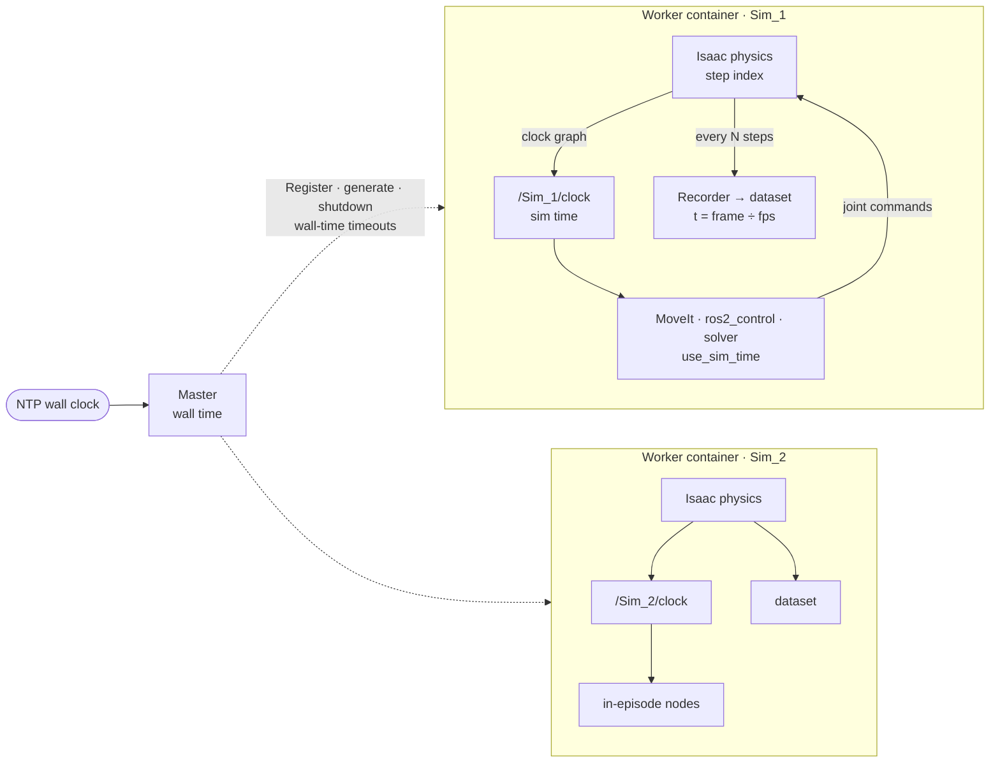

# Clocks: simulation time and wall time

> **Scope** — *For GUIDE developers.* Which clock each part of a GUIDE deployment runs on: the
> simulator, its task nodes, its datasets, the container runner and a future master. Source of
> truth: `guide_core/guide_core/scene/scene_manager.py` (`SceneManager.step`),
> `guide_core/guide_core/scene/scene_orchestrator.py` (`SceneOrchestrator.record_step`),
> `guide_core/guide_core/scene/scene_recorder.py` (`SceneRecorder._process_frame`),
> `guide_core/guide_core/core/commands/_cmd_robot.py` (`_cmd_create_clock`),
> `guide_core/guide_core/ros/guide_ros.py` (`GUIDEROS2Interface`),
> `guide_tasks/*/launch/bringup.launch.py` (`generate_nodes`),
> `irob_lerobot_ros/ros2robot.py` (`ROS2Robot`).

GUIDE has two kinds of time. **Sim time** belongs to one simulator. It advances with that
simulator's physics, whether the GPU runs it faster or slower than real time. **Wall time** is the
host's clock, kept consistent across machines by NTP. A dataset must describe what happened in sim
time, and everything that moves the robot during an episode must therefore wait in sim time too.
Everything that only orchestrates (deadlines, health, scheduling, file names) runs on wall time.
There is no global sim clock: every simulator has its own, at its own speed, and they never meet.

## The clocks

| Clock | Source | Used by | Reach |
|---|---|---|---|
| Physics step index | Isaac `World.current_time_step_index` | `SceneManager.step` (record interval = physics Hz ÷ dataset fps); `SceneOrchestrator.record_step` stamps each frame with it | one simulator, internal |
| `/Sim_<id>/clock` (sim time) | Isaac's clock graph, created by `_cmd_create_clock` in the simulator's namespace | MoveIt, ros2_control and the solver (`use_sim_time`; task launches `SetRemap` `/clock` to it); `ROS2Robot` rates and timers | one simulator; restarts at 0 whenever the timeline stops |
| Dataset time | LeRobot `DatasetWriter`: `timestamp = frame_index / fps` | training, evaluation, the language columns | one episode, starting at 0 |
| Wall time | the host clock (NTP) | `GUIDEROS2Interface` (no `use_sim_time`; `FINALIZE_TIMEOUT_S`), `ROS2Robot.callService` timeouts, the container runner, the master, dataset folder names | every machine |

## How time flows

Inside a worker, the physics step drives everything that ends up in the data: the sampling of
frames, and the sim clock that MoveIt and the controllers follow. Between workers nothing is
shared. `/Sim_1/clock` and `/Sim_2/clock` run at different rates and restart independently, so a
sim timestamp from one simulator means nothing in another. The master sits outside every
simulator on wall time. It talks to workers through services and events, never through a clock.

## Which clock each part uses

| Part | Clock | Why |
|---|---|---|
| Recorder and dataset | physics steps → `frame_index / fps` | the data is identical whether the simulator ran at real-time factor 0.3 or 3 |
| In-episode nodes (MoveIt, ros2_control, solver, `ROS2Robot`) | `/Sim_<id>/clock` (`use_sim_time`) | trajectories, settling and waits happen in the same time the data is recorded in |
| GUIDE's service layer, the container runner | wall | their deadlines bound wall-time work (writing videos, building tasks) and detect dead processes |
| Master | wall; never `use_sim_time`; never compares sim timestamps of two simulators | there is no shared sim time to follow, and each simulator's resets independently |
| Swarm nodes | NTP (`chrony`) | wall timestamps in logs and events from different machines line up |

The master does use a clock, the wall clock. What it cannot do is follow a simulation clock,
because there is none that spans simulators. It may still read one simulator's `/Sim_<id>/clock`
to see whether that simulator is alive (a clock that stops advancing means a frozen simulator), but
never as its own time base. Likewise, the time in a dataset is episode-relative sim time (frame k
is at k ÷ fps seconds after the episode began), not the absolute value of `/Sim_<id>/clock`, which
restarts at 0 whenever the timeline stops.

## Known gaps

- **Dataset time is the frame count, not the recorded step.** LeRobot stamps frame k at k ÷ fps.
  That equals sim time only while no frame is lost. A frame dropped by a full recorder queue
  (`SceneRecorder.put_record_data`) shifts every later timestamp of that episode by 1 ÷ fps. The
  physics step each frame carries (the `timestamp` from `SceneOrchestrator.record_step`) only
  reaches a log line in `SceneRecorder._process_frame`. Keeping it as a column, or failing an
  episode with drops, would close this.
- **Wall-time waits inside an episode.** `SetGripperState` sleeps `SETTLE_SECONDS` with
  `time.sleep`, and `block_bin`'s `solveTask` sleeps 5 s after randomizing. The sim time that
  passes during those waits scales with the simulator's speed. With more scenes per simulator, or
  segmentation on, the robot gets less time to settle, so recorded behaviour depends on load.
  Waiting on the node's sim clock (`ROS2Robot` already builds rates and timers on it) would close this.
- **Register resets a running simulator.** `GUIDEROS2Interface._register_callback` calls
  `stop()` (`_cmd_stop`, `World.stop`). That returns every scene to its start state, and the clock
  graph's `ReadSimTime` (`resetOnStop: True`) restarts sim time at 0. Registering while another
  scene records corrupts that episode and makes time jump back for every in-episode node. A master
  must register before generating, or Register must refuse while a scene records.
- **No NTP step in the host setup** (`docs/superpowers/plans/2026-10-09-guide-docker-v4.md`, Task 0).
