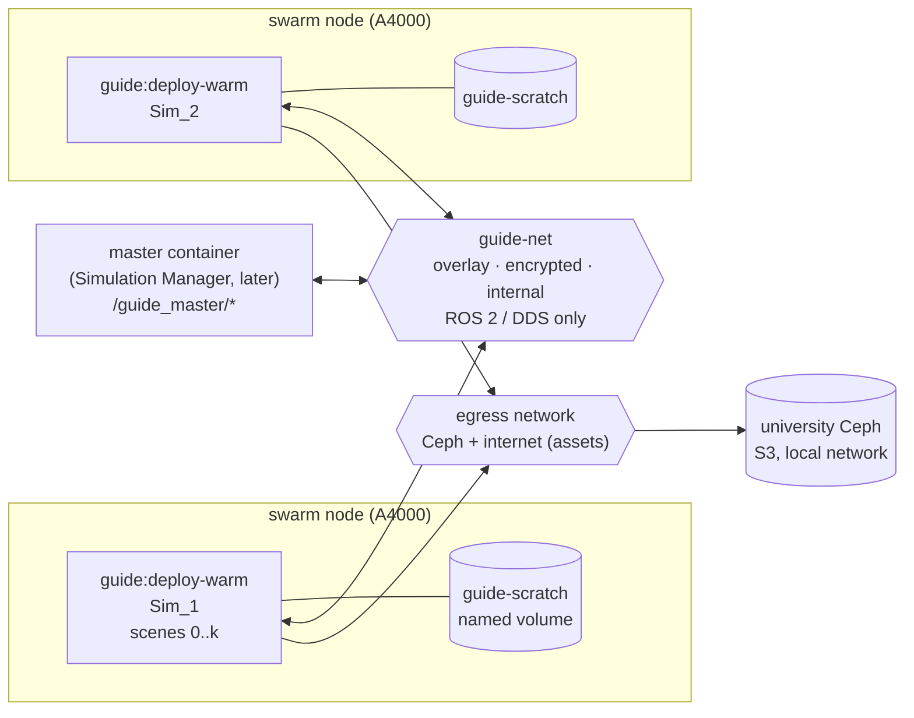
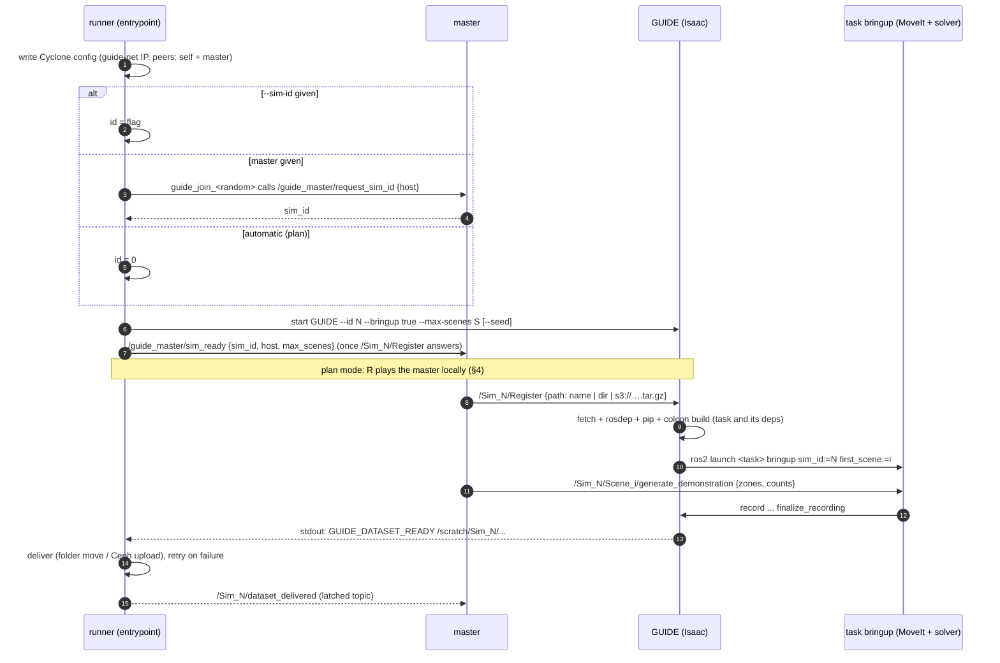
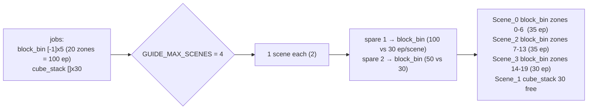
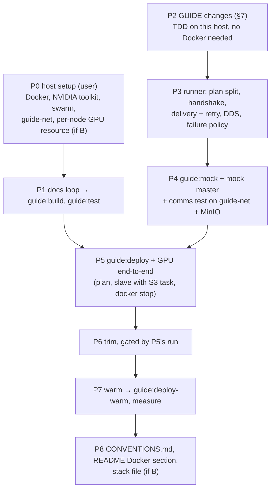

# GUIDE Docker images — design v2

Date: 2026-10-09 · Branch: `feat/docker` (from `dev` 834bb48) · Status: **draft for review**.
v2 folds in the user's answers to the v1 questions. Decisions still open are in
[§12](#12-open-decisions).

## 1. What we are building

GUIDE demonstration generation in containers on a Docker swarm.
- One container is one simulator (`Sim_<id>`) on one GPU (an A4000 on every node), with
  several scenes.
- Several containers are several simulators, each with a unique id.
- A container either runs a plan by itself (automatic mode, id 0, exits when done) or
  serves as a slave to a master container (the future Simulation Manager) over ROS 2.
- Datasets are recorded on a local volume and delivered per dataset, when finished, to a
  mounted folder or to the university Ceph (S3).
- ROS 2 traffic never leaves the private overlay network.

Out of scope now: the master itself (only its interface and a stand-in), data curation
and post-processing, a policy-testing image, and registry/CI (images are built locally;
GitHub Actions comes later).

## 2. Topology



- **Two networks per container.**
  - `guide-net` is an `--internal`, `--opt encrypted`, attachable overlay. It carries all
    ROS 2 traffic: Cyclone is pinned to its interface.
  - A second network, `guide-egress` (an ordinary, non-internal attachable overlay; swarm
    services cannot join the default `bridge`), gives access to Ceph on the local network
    and to the internet (Isaac assets, NVIDIA's extension registry, rosdep/pip for tasks).
- **Discovery is unicast** (overlay networks carry no multicast). Each container's peers are
  itself and the master. Slaves never see each other.
- **No published ports.** Camera topics stay off, so camera data never leaves the container.

## 3. One container's life



**No polling anywhere (the "polling rate" question).** Every signal is pushed:
- the runner reads GUIDE's stdout line by line as it arrives;
- the master gets `/Sim_N/dataset_delivered` pushed. The topic is transient-local, so a
  master that starts later still receives the history.

The only timed loop is the runner checking once a second whether it was asked to stop.
`wait_for_service` uses DDS discovery, not a request loop.

## 4. Plan mode (automatic)

Input is `--plan FILE|s3://…` or `GUIDE_PLAN`. The id is 0 unless given. The container
exits when done: 0 if every job got its counts.

```yaml
output: s3://guide-datasets/run-2026-10   # or a mounted folder; --output / GUIDE_OUTPUT win
seed: 1234                                # optional: the simulator's master seed
jobs:                                     # was "scenes" in v1: a job may now span scenes
  - {task: block_bin, zones: [-1], counts: [5]}          # 5 in every zone (20 zones = 100)
  - {task: s3://guide-tasks/cube_stack.tar.gz, counts: [30]}   # 30 free draws
```

**Splitting across scenes.** `GUIDE_MAX_SCENES` caps the scenes one simulator runs in
parallel. If unset: in plan mode, one scene per job (no splitting); in slave mode, no cap.
1. Every job gets one scene. A plan with more jobs than `GUIDE_MAX_SCENES` is rejected
   before Isaac starts.
2. Each job's first scene is registered. Register now also returns the scene's `num_zones`,
   computed by GUIDE from the task's `randomize.yaml` the same way the solver does, so
   `[-1]` becomes an explicit zone list without the runner knowing the task.
3. Each spare scene goes to the job with the most episodes per scene, one at a time.
4. A job's work is cut into near-equal parts:
   - explicit zones are dealt out by count, so each part has whole zones;
   - free draws split the count.



The runner then requests `generate_demonstration` per scene, with
`path=/scratch/Sim_0/scene_<i>`. It waits for one marker per scene, checks the per-zone
episode counts (`meta/guide_episodes.jsonl`), delivers each dataset as it finishes, and
exits when all are done.

## 5. Slave mode

- Nothing is registered at start. GUIDE comes up empty and the container reports
  `sim_ready` to the master.
- The master calls `/Sim_N/Register` with a task. Register fetches it, builds it with its
  dependencies, adds the scene and launches the task's bringup for that scene.
- Register refuses once the simulator holds `GUIDE_MAX_SCENES` scenes ("simulator full").
- The master then calls `generate_demonstration` per scene. Every finished dataset is
  delivered and announced.
- The container never exits on its own.

## 6. Sim id

The id comes from `--sim-id` / `GUIDE_SIM_ID` if given. Otherwise the master is asked
through the handshake in §3 (2 and 3). Otherwise it is 0.

Handshake:
1. A node with a random name (`guide_join_<8 hex>`) calls
   `/guide_master/request_sim_id {host}`. The master answers with a free id, and may return
   the same id to a restarted container from the same host.
2. The runner starts GUIDE with that id.
3. Once `/Sim_N/Register` answers, the runner calls
   `/guide_master/sim_ready {sim_id, host, max_scenes}`.

GUIDE itself stays unaware of the master. New interfaces in `guide_msgs`:
`RequestSimId.srv`, `SimReady.srv`, and `int32 num_zones` added to `RegisterScene`'s
response. The mock image ships a stand-in master that serves both, for the communication
test.

## 7. GUIDE changes

| Change | Where | Why |
|---|---|---|
| `parse_known_args`; `--set KEY=VALUE` (bare key = `startup.*`, YAML value) | `guide_ros.py` | ROS 2 appends its own arguments; render device / headless from the container |
| `--bringup`, `--tasks-dir`, `--max-scenes`, `--seed` | `guide_ros.py`, `scene_manager.py` | Register builds and launches; capacity; reproducible draws (`SeedTree.create(master=seed)`) |
| Register: `TaskBringup.prepare` before `stop()`, `launch` after `play()`; returns `num_zones`; refuses beyond `--max-scenes` | `guide_ros.py`, new `task_bringup.py`, `RegisterScene.srv` | slave mode + scene splitting |
| `/Sim_N/clock` (clock graph in the namespace); task launches take `sim_id`, `first_scene`, and `SetRemap('/clock' → '/Sim_N/clock')` | `guide_ros.py`, both `bringup.launch.py` | simulators run at different speeds |
| `GUIDE_DATASET_READY <dir>` / `GUIDE_DATASET_EMPTY <task>` on stdout | `scene_recorder.py` | completion signal (the "finalized" log line goes to a file, before the language columns) |

`block_bin_eval` (own repo) then remaps `/clock:=/Sim_0/clock`.

## 8. Task bundles (`.tar.gz`)

```
cube_stack.tar.gz
├── cube_stack/            exactly one task package: <pkg>/<pkg>/scene.py + package.xml
├── fr3_custom_moveit/     any dependency packages (e.g. the robot's MoveIt config)
└── requirements.txt       optional: pip dependencies (installed with Isaac's pins)
```

- System dependencies come through rosdep from the `package.xml` files.
- The container builds the dependencies first and the task last (`colcon --merge-install
  --packages-up-to <task>`) into `<tasks-dir>/install`, which GUIDE adds to its own paths.
- No new message or service packages: none come with tasks.
- An already-installed task name or a local directory work the same way.
- Deferred: `deps.repos` (git dependencies), to add when one is needed.

## 9. Delivery and storage

- **Scratch** is the named volume `guide-scratch` at `/scratch`, one folder per simulator
  (`/scratch/Sim_N/`).
- **Folder target:** `<output>/Sim_N/<dataset>`, chowned to the folder's owner (see §12 C).
- **Ceph target:** `s3://bucket/prefix/Sim_N/<dataset>/…`
  - boto3 with path-style addressing (safe for Ceph RGW);
  - endpoint from `AWS_ENDPOINT_URL`;
  - credentials from the secret file `/run/secrets/guide_s3` (AWS credentials format, via
    `AWS_SHARED_CREDENTIALS_FILE`).
- The scratch copy is deleted only after every file is uploaded.
- A failed upload keeps the dataset and retries (§12 B).
- **Secrets never enter the repo:** `.gitignore` gets `docker/secrets/` and `*.env`.

## 10. Images

| Image | Built from | Purpose |
|---|---|---|
| `guide:build` / `guide:test` | `ros:jazzy-ros-base` + README "Prerequisites" and "Installation" blocks run verbatim | docs loop; pytest without a GPU + GPU smoke test |
| `guide:deploy` | `base` + trimmed `.venv` + `install/` + entrypoint | production, data generation only |
| `guide:deploy-warm` | `docker commit` after `docker/warm.sh` (one episode per task) | what nodes run: shader/asset caches baked in |
| `guide:mock` | `ros:jazzy-ros-core` + `guide_msgs` + runner + mock sim + mock master | communication tests, no GPU |

- **Docs loop:** a build failure is fixed in README/INSTALLATION, never worked around in
  the Dockerfile.
  - Already fixed: `franka_ros2` now tracks its `COLCON_IGNORE`s (commit aa5fd9d on
    `jazzy`, not pushed yet).
  - Known next: `lerobot[dataset]`; `isaacsim[all]` vs the subset; `RMW_IMPLEMENTATION`;
    `psmisc`; INSTALLATION §6.2.
  - GUIDE itself comes from the build context, because `origin/dev` is 116 commits behind
    local `dev`.
- **Trim, each cut gated by the GPU end-to-end run:**
  - multi-stage (from the ROS workspace only `install/`, with the DDS config);
  - the isaacsim subset;
  - unused Kit extensions (~8.8 GB) and their test/doc folders (~1.2 GB);
  - torch cu130 only;
  - no training extras;
  - exact apt list with `--no-install-recommends`;
  - stripped `.so` files;
  - Kit logs capped (stdout goes to `docker logs`);
  - crash reporter off.
- **Warm cache:** one A4000 model everywhere, so one warm image serves all nodes, provided
  the NVIDIA driver version matches too (the cache is driver-keyed). Pin the driver across nodes.
- **GitHub Actions later:** hosted runners have no GPU and about 14 GB of free disk. The
  build needs a larger or self-hosted runner, and the warm step must run on a GPU node.

## 11. Conventions (to be kept in `docker/CONVENTIONS.md`)

| What | Convention |
|---|---|
| Simulator namespace | `/Sim_<id>`; scenes `/Sim_<id>/Scene_<i>`; clock `/Sim_<id>/clock` |
| Master interface | `/guide_master/request_sim_id` (RequestSimId), `/guide_master/sim_ready` (SimReady) |
| Delivery topic | `/Sim_<id>/dataset_delivered`, `std_msgs/String` JSON `{dataset, target, complete}`, transient-local, depth 100 |
| Stdout markers | `GUIDE_DATASET_READY <dir>`, `GUIDE_DATASET_EMPTY <task_name>` |
| Env | `GUIDE_SIM_ID`, `GUIDE_PLAN`, `GUIDE_OUTPUT`, `GUIDE_MAX_SCENES`, `GUIDE_MASTER`, `GUIDE_DDS_SUBNET`, `AWS_ENDPOINT_URL`, `AWS_SHARED_CREDENTIALS_FILE` (each flag has its env twin) |
| Networks | `guide-net` 10.42.0.0/24 overlay, attachable, internal, encrypted (DDS only); `guide-egress` overlay, attachable (Ceph, internet) |
| Volume | `guide-scratch` → `/scratch`, per simulator `/scratch/Sim_<id>/` |
| Secret | `guide_s3` → `/run/secrets/guide_s3` |
| Output | `<output>/Sim_<id>/<dataset>`; dataset name from the recorder (`<task_name>_<YYYY_MM_DD_HH_MM_SS>`) |
| Task bundle | `.tar.gz` (§8) |
| Images | `guide:<version>-{build,test,deploy,deploy-warm,mock}`, base images pinned by digest |
| Paths | `/root/ros2_ws/.venv`, `/root/ros2_ws/install` (absolute prefixes, same as the README) |

## 12. Open decisions

**A. How the GPU containers are started.** (Q3: "I don't understand.")

Swarm can start containers in two ways, and they differ on GPUs:

| | A. Swarm only for the network; `docker run` per node | B. Swarm services (a stack file) |
|---|---|---|
| GPU | `docker run --gpus device=0` just works | needs a one-time daemon setup per node: the GPU advertised as a "generic resource" and nvidia as the default runtime |
| Secrets (Ceph) | no swarm secrets: a root-only file is bind-mounted at the same path | real swarm secrets (Q16) |
| Restart after a crash | per node (`--restart on-failure`) | swarm restarts or reschedules |
| Sim id without a master | flag per `docker run` | template `GUIDE_SIM_ID={{.Task.Slot}}` gives every replica its own |
| Master address | fixed IP on `guide-net` | the service's virtual IP stays the same across master restarts |
| Starting N simulators | one command per node (a script) | `docker stack deploy` once |

Recommendation: **B**. You chose swarm secrets, and B gives restarts and stable addressing
for free. The one-time per-node GPU setup goes into the host-setup notes. A stays possible
for single-host testing.

**B. Failures** (Q14, to discuss):

| Failure | What happens today | Proposal |
|---|---|---|
| Episode fails | solver discards and retries | keep |
| A scene gives up (5 errors / 8 attempts) | dataset finalized short | deliver it marked `complete: false`. Plan mode: request the missing counts once more on that scene (new dataset). Slave mode: report only; the master decides |
| Isaac/GUIDE crashes | the dataset in progress is never finalized, so it is unreadable | container exits non-zero → restarted. On start the runner moves unfinalized datasets to `/scratch/Sim_N/broken/` (kept, not delivered), delivers finalized leftovers, and in plan mode resumes from `plan_state.json` (delivered counts per job and zone) |
| Ceph down | upload raises | keep local, retry with backoff (1, 2, 4 … 30 min) forever; stop accepting new generation when scratch is 90 % full |
| `docker stop` / reschedule | SIGINT → GUIDE finalizes all → delivered within the 180 s grace | keep |
| Master gone | slaves keep working and delivering | keep; `sim_ready` is re-sent when the master reappears |

**C. Output ownership** (Q29: "Explain further.")

- **Why there is a problem:** the container runs as root, because Register runs `rosdep`,
  which installs apt packages. Everything it writes into a mounted host folder is
  root-owned, so on the host you can't delete or rename those datasets without `sudo`.
- **Proposal:** after moving a dataset into the folder, the runner gives it to whoever owns
  that folder. Nothing to configure; S3 is unaffected.

## 13. Build order



P2 and P3 can start right away. The Docker phases wait for P0.
