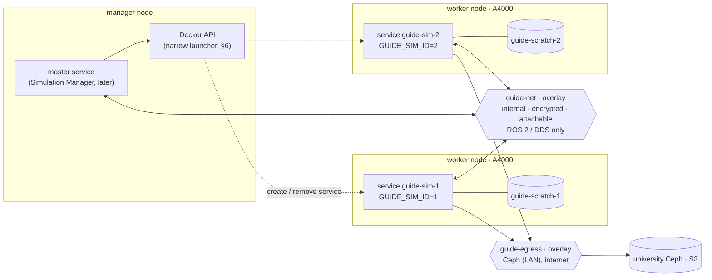
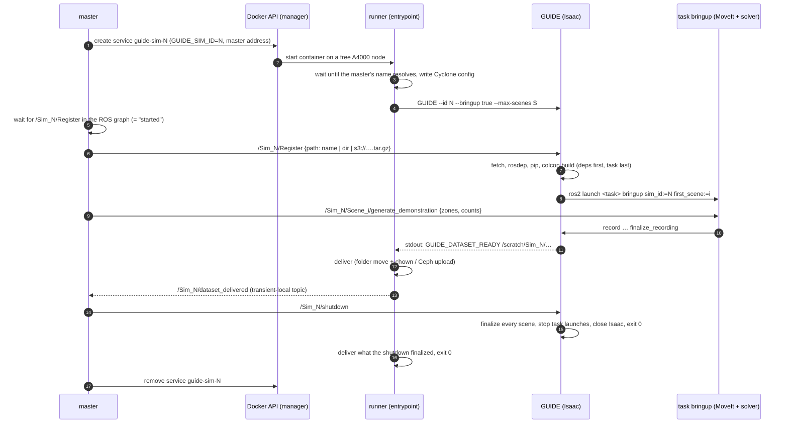
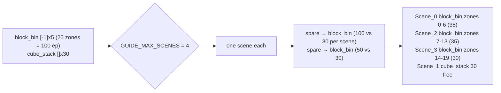
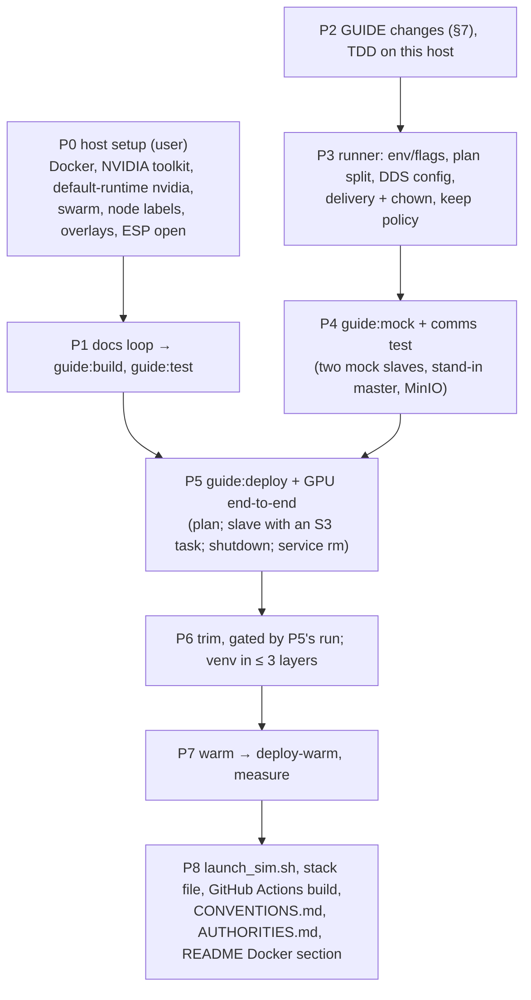

# GUIDE Docker images — design v3

Date: 2026-10-09 · Branch: `feat/docker` (from `dev` 834bb48) · Status: **draft for review**

| Version | Changes |
|---|---|
| v1 → v2 | the user's answers to the v1 questions |
| v2 → v3 | Simulators are swarm services; the sim id is set by whoever starts the container, so the handshake and its two service types are dropped. The master launches simulators itself and can shut them down through a `/Sim_N/shutdown` service that GUIDE also has outside Docker. Failures: keep policy. Output ownership plus a record of authorities (§12). GitHub Actions builds; nodes run (§10). |

## 1. What we are building

GUIDE demonstration generation in containers on a Docker swarm.
- One container is one simulator (`Sim_<id>`) on one A4000, with several scenes.
- Several containers are several simulators, each with a unique id.
- A container either runs a plan by itself (automatic: id 0, exits when done) or is a
  slave that a master container (the future Simulation Manager) launches, commands over
  ROS 2 and shuts down.
- Datasets are recorded on a local volume and delivered per dataset to a mounted folder or
  the university Ceph (S3).
- ROS 2 traffic stays on the private overlay.

**GUIDE in a container behaves the same as GUIDE run by hand.** Everything a master calls
(Register, generate, shutdown) is GUIDE's own ROS interface and works identically outside
Docker. The container entrypoint only adds glue: DDS config, flags from the environment,
plan driving, delivery.

Out of scope now: the master itself (its side of the interfaces is specified here), data
curation, a policy-testing image.

## 2. Topology



- **Two overlays per simulator.**
  - The DDS overlay is `--internal`: no gateway, no external DNS.
  - Joining the normal `guide-egress` overlay as well gives the container Docker's
    gateway, so it reaches Ceph and the internet.
  - Cyclone is pinned to the `guide-net` subnet, because the container has three
    interfaces (two overlays and the gateway).
- **Discovery is unicast.** Each simulator's peers are itself and the master. A slave
  never learns of another slave; the master learns every slave from its discovery packets,
  which Cyclone answers even from unlisted peers.
- **No published ports.** Camera topics stay off, so camera data never leaves the container.
- **The encrypted overlay** needs IP protocol 50 (ESP), 2377/tcp, 7946/tcp+udp and 4789/udp
  between nodes (host setup).

## 3. A slave's life, master-launched



**Nothing polls.**
- The runner reads GUIDE's stdout line by line as it arrives.
- The master gets deliveries pushed, and a master that starts later still receives the
  history because the topic is transient-local.
- A simulator's readiness is the appearance of its `Register` service in the ROS graph,
  which DDS discovery reports.

## 4. Plan mode (automatic)

Input is `GUIDE_PLAN` (a file or `s3://…`). Id 0 unless `GUIDE_SIM_ID` is set. The
container exits when done: 0 if every job got its counts.

```yaml
output: s3://guide-datasets/run-2026-10   # or a mounted folder; GUIDE_OUTPUT wins
seed: 1234                                # optional: the simulator's master seed
jobs:
  - {task: block_bin, zones: [-1], counts: [5]}                # 5 in every zone
  - {task: s3://guide-tasks/cube_stack.tar.gz, counts: [30]}   # 30 free draws
```

**Splitting across scenes.** `GUIDE_MAX_SCENES` caps the scenes one simulator runs at once.
If unset: one scene per job in plan mode; no cap in slave mode.
1. Each job gets one scene. More jobs than the cap is an error before Isaac starts.
2. Each job's first scene is registered. Register returns the scene's `num_zones`, which
   GUIDE computes from the task's `randomize.yaml` the same way the solver does. That
   turns `[-1]` into an explicit zone list.
3. Spare scenes go one at a time to the job with the most episodes per scene.
4. A job's work is dealt out by count: explicit zones as whole zones, free draws by
   splitting the count.



The runner plays the master's part locally: Register, generate (one dataset per scene,
under `/scratch/Sim_0/scene_<i>`), deliver each as it finishes. When all are delivered it
calls `/Sim_0/shutdown`, which is the same exit as a master's.

## 5. Slave mode

- **At start:** no tasks are loaded.
- **Register** fetches and builds the task with its dependencies, adds the scene and
  launches the task's bringup for that scene. It refuses with "simulator full" at
  `GUIDE_MAX_SCENES`.
- **Generation:** the master requests `generate_demonstration` per scene. Every finished
  dataset is delivered and announced.
- **Exit:** the container only exits on `/Sim_N/shutdown`, or on SIGTERM when the service
  is removed. Both take the same finalize-and-deliver path.

## 6. Sim id and launching

**The id is always known before the container starts.** `GUIDE_SIM_ID` is set by whatever
starts it:

| Started by | How the id is set | Notes |
|---|---|---|
| **The master (recommended for slaves)** | it creates service `guide-sim-<id>` with `GUIDE_SIM_ID=<id>` through the Docker Engine API | The master picks free ids and knows which service is which. Readiness is `/Sim_<id>/Register` appearing. A restart keeps the id (same service spec). No placement left means the task stays *pending*, which is the "no capacity" signal. |
| A fixed fleet (stack file) | `GUIDE_SIM_ID={{.Task.Slot}}` | Swarm fills the template when it creates each replica: 1…N. A restarted or rescheduled replica keeps its slot. Scaling down can leave gaps. The master finds simulators in the ROS graph. |
| A person | `GUIDE_SIM_ID=…` / `--sim-id` | |
| Nobody (automatic plan) | 0 | |

No handshake and no self-registration, so no new service types. If a container ever has to
ask for an id, the entrypoint can do it with `ros2 service call` (no extra node code).

**What launching through the Docker API costs** (security record, §12):
- Service endpoints exist only on a manager node, so the launcher runs there with
  `/var/run/docker.sock`.
- That socket is root on that host and, through `services/create`, on every node.
- A socket proxy restricted to `/services` still lets a crafted create escalate.
- **Recommended (with the master, later):** a small launcher on the manager that builds the
  `guide-sim-<id>` spec itself and offers the master only `start(id)` / `stop(id)`. The
  master then never holds the socket.
- For now, `docker/launch_sim.sh <id>` is the reference spec, used by hand.

**GPU placement.** Swarm services cannot take `--gpus` or devices: open since swarmkit
#1244, and Engine 29's CDI support covers `docker run` only.
- Every node gets `default-runtime: nvidia`; the image sets `NVIDIA_VISIBLE_DEVICES=all`
  and `NVIDIA_DRIVER_CAPABILITIES=all`.
- Services are placed with a node label (`guide.gpu=a4000`) and `max_replicas_per_node: 1`.
- This skips "generic resources", which have two known traps: the env name
  `DOCKER_RESOURCE_NVIDIA-GPU` doesn't match the toolkit's `swarm-resource` setting, and
  toolkit 1.18's jit-cdi mode ignores swarm assignments.
- Generic resources become worth it for multi-GPU nodes.
- The dev host (A2000 + A4000) overrides `render_device=cuda:1`; the nodes use the image
  default `cuda:0`.

## 7. GUIDE changes

| Change | Where | Why |
|---|---|---|
| `parse_known_args`; `--set KEY=VALUE` (bare key = `startup.*`, YAML value) | `guide_ros.py` | ROS 2 appends its own arguments; render device and headless per deployment |
| `--bringup`, `--tasks-dir`, `--max-scenes`, `--seed` | `guide_ros.py`, `scene_manager.py` | Register builds and launches; capacity; `SeedTree.create(master=seed)` |
| Register: `TaskBringup.prepare` before `stop()`, `launch` after `play()`; returns `num_zones`; refuses beyond `--max-scenes` | `guide_ros.py`, new `task_bringup.py`, `RegisterScene.srv` | slave mode, scene splitting |
| **`/Sim_N/shutdown`** (`std_srvs/Trigger`) and Ctrl-C share one path: finalize every scene, stop the task launches, close Isaac (the existing, never-called `_cmd_shutdown`), exit 0 | `guide_ros.py` | The master stops a simulator without Docker access. It also fixes Ctrl-C today: datasets get finalized but nothing ends Isaac's main loop |
| `/Sim_N/clock`; task launches take `sim_id`, `first_scene` and `SetRemap('/clock'→'/Sim_N/clock')` | `guide_ros.py`, both `bringup.launch.py` | simulators run at different speeds |
| `GUIDE_DATASET_READY <dir>` / `GUIDE_DATASET_EMPTY <task>` on stdout | `scene_recorder.py` | completion signal; the "finalized" log line goes to a file, before the language columns |

`block_bin_eval` (own repo) then remaps `/clock:=/Sim_0/clock`.

## 8. Task bundles (`.tar.gz`)

```
cube_stack.tar.gz
├── cube_stack/            exactly one task package: <pkg>/<pkg>/scene.py + package.xml
├── fr3_custom_moveit/     dependency packages (e.g. the robot's MoveIt config)
└── requirements.txt       optional: pip dependencies (installed with Isaac's pins)
```

- System dependencies come through rosdep from the `package.xml` files.
- Built with `colcon --merge-install --packages-up-to <task>` (dependencies first) into
  `<tasks-dir>/install`, which GUIDE then adds to its own paths.
- Bundles bring no new message or service packages.
- An already-installed task name, or a local directory, works the same way.
- Deferred: git dependencies (`deps.repos`).

## 9. Delivery, storage, failures

- **Scratch:** the named volume `guide-scratch-<id>` at `/scratch`. A volume is local to its
  node, so a rescheduled simulator starts with an empty one; what it held stays on the old
  node.
- **Folder target:** `<output>/Sim_<id>/<dataset>`, then chowned to the folder's owner.
- **Ceph target:** `s3://bucket/prefix/Sim_<id>/<dataset>/…`
  - boto3 with path-style addressing;
  - endpoint from `AWS_ENDPOINT_URL`;
  - credentials in the swarm secret `guide_s3` (AWS credentials format, read through
    `AWS_SHARED_CREDENTIALS_FILE=/run/secrets/guide_s3`);
  - the scratch copy is deleted only after every file is uploaded.
- **Failures, keep policy (for now): nothing is ever deleted unless delivered.**
  - Failed episodes are retried by the solver, as today.
  - A scene that gives up delivers its short dataset marked `complete: false`.
  - A failed upload leaves the dataset in scratch and is announced with `target: null`.
  - A crash leaves the unfinished dataset in scratch untouched, and swarm restarts the
    container with the same id and volume.
  - `docker service rm` and `/Sim_N/shutdown` both finalize and deliver within the 180 s
    grace period.
  - Deferred: topping up short scenes, resuming a plan, upload retries, sorting out
    broken datasets.
- **`.gitignore`** gets `docker/secrets/` and `*.env`.

## 10. Images, build and run

| Image | Built from | Purpose |
|---|---|---|
| `guide:build` / `guide:test` | `ros:jazzy-ros-base` + README "Prerequisites" and "Installation" blocks run verbatim | docs loop; pytest without a GPU |
| `guide:deploy` | `base` + trimmed `.venv` (in ≤ 3 layers) + `install/` + entrypoint | data generation |
| `guide:deploy-warm` | `docker commit` after `docker/warm.sh` on a GPU node | what nodes run |
| `guide:mock` | `ros:jazzy-ros-core` + `guide_msgs` + runner + mock simulator | communication tests, no GPU |

**Docs loop.**
- A build failure is fixed in README/INSTALLATION, never worked around in the Dockerfile.
- Done: `franka_ros2` tracks its `COLCON_IGNORE`s (aa5fd9d; the user pushes it).
- Known next: `lerobot[dataset]`; the `isaacsim[all]` vs subset question;
  `RMW_IMPLEMENTATION`; `psmisc`; INSTALLATION §6.2.
- GUIDE comes from the build context, because `origin/dev` lags local `dev` by 116 commits.

**Trim.** Each cut is gated by the GPU end-to-end run:
- from the ROS workspace only `install/` plus the DDS config;
- the isaacsim subset;
- unused Kit extensions (about 8.8 GB) and their test/doc folders (about 1.2 GB);
- torch cu130 only;
- no training extras;
- exact apt list with `--no-install-recommends`;
- stripped `.so` files;
- Kit logs capped;
- crash reporter off.

**GitHub Actions builds; self-hosted nodes run.** Viable, with three adjustments:
1. **Disk.** A standard runner has about 22 GB free (about 53 GB after the usual cleanup),
   plus a mostly empty `/mnt` of about 74 GB. The build peaks around 45–55 GB, so it moves
   Docker's data root to `/mnt` (or merges the disks) and installs with `--no-cache`.
   The 10 GB free Actions cache can't hold the layers, so builds don't use a `gha` cache.
2. **GHCR** limits each layer to 10 GB and each upload to 10 minutes. The deploy stage
   therefore copies the venv as 2–3 layers (isaacsim / nvidia+torch / rest), each well
   under the limit.
3. **No GPU on hosted runners**, so warming is a self-hosted job on one A4000 node. That
   node commits and pushes `deploy-warm`, which every node pulls. One warm image fits all
   nodes only if the NVIDIA driver version matches too, so pin the driver across nodes.

The image stays private in GHCR, because Isaac Sim's binaries are under NVIDIA's license.

## 11. Conventions (become `docker/CONVENTIONS.md`)

| What | Convention |
|---|---|
| Namespaces | `/Sim_<id>`; scenes `/Sim_<id>/Scene_<i>`; clock `/Sim_<id>/clock` |
| GUIDE services | `/Sim_<id>/Register` (returns `num_zones`), `/Sim_<id>/shutdown` (`std_srvs/Trigger`), `/Sim_<id>/Scene_<i>/generate_demonstration` |
| Delivery topic | `/Sim_<id>/dataset_delivered`: `std_msgs/String` JSON `{dataset, target, complete}`, transient-local, depth 100 |
| Stdout markers | `GUIDE_DATASET_READY <dir>`, `GUIDE_DATASET_EMPTY <task_name>` |
| Environment | `GUIDE_SIM_ID`, `GUIDE_PLAN`, `GUIDE_OUTPUT`, `GUIDE_MAX_SCENES`, `GUIDE_MASTER` (DNS name or VIP), `GUIDE_SET` (`;`-separated init.yaml overrides), `AWS_ENDPOINT_URL`, `AWS_SHARED_CREDENTIALS_FILE` |
| Services | `guide-sim-<id>` (slaves), `guide-master`; node label `guide.gpu=a4000`, `max_replicas_per_node: 1`, stop grace 180 s, restart on failure |
| Networks | `guide-net` 10.42.0.0/24 (internal, encrypted, attachable; DDS only), `guide-egress` (attachable) |
| Volume / secret | `guide-scratch-<id>` → `/scratch`; secret `guide_s3` → `/run/secrets/guide_s3` |
| Output | `<output>/Sim_<id>/<dataset>`; dataset name from the recorder |
| Task bundle | `.tar.gz` as in §8 |
| Images | `ghcr.io/abc-irobotics/guide:<version>-{test,deploy,deploy-warm,mock}` (private); base images pinned by digest |
| Paths | `/root/ros2_ws/.venv`, `/root/ros2_ws/install` |

## 12. Authorities (security record, becomes `docker/AUTHORITIES.md`)

For the team's risk analysis: who can do what, why, and what limits it.

| Holder | Authority | Why | Risk | Limited by |
|---|---|---|---|---|
| Simulator container | runs as root | Register runs `rosdep` (apt) for task dependencies | an escape from the container is root on the node | no `--privileged`, no host mounts except the output folder, default seccomp/AppArmor, no Docker socket |
| Anyone on `guide-net` | calls `Register` → downloads and **executes** task code (colcon/setup.py, launch files, pip, apt) | slave mode | `guide-net` membership means code execution in every simulator | `guide-net` is internal and encrypted, joined only by GUIDE services; later SROS2 |
| Anyone on `guide-net` | calls `generate_demonstration`, `shutdown` | master control | a stray peer can stop or occupy a simulator | as above |
| Task code (incl. downloaded) | reads `/run/secrets/guide_s3`, reaches Ceph and the internet | delivery, assets, dependencies | credential theft, data exfiltration | Ceph key scoped to write-only on one bucket/prefix |
| Runner | `chown`s delivered datasets to the output folder's owner | host users can manage their data without `sudo` | none beyond root's | only inside the delivered dataset folder |
| Container | all GPU capabilities (`NVIDIA_DRIVER_CAPABILITIES=all`) | Isaac renders (graphics, video for NVENC) | driver attack surface | the A4000 node only |
| Master / launcher | Docker socket on a manager | create/remove `guide-sim-<id>` | root on every node of the swarm | narrow launcher (`start(id)`, `stop(id)`) instead of the socket in the master |
| Users in the `docker` group | control the Docker daemon | operating the swarm | root-equivalent on that host | keep the group small |
| Image | contains NVIDIA Isaac Sim; the EULA is accepted by `OMNI_KIT_ACCEPT_EULA=YES` | headless start | licence: the team accepts NVIDIA's EULA for every deployment | private GHCR package |
| Kit | crash reporter **off** | — | (removed: crash dumps uploaded to NVIDIA) | `--/crashreporter/enabled=false` |
| GitHub Actions | pushes images to GHCR | CI build | a compromised workflow ships a bad image | `GITHUB_TOKEN` with `packages: write` on this repo only; pinned action versions |

## 13. Build order



P2 and P3 can start now. The Docker phases need P0.
