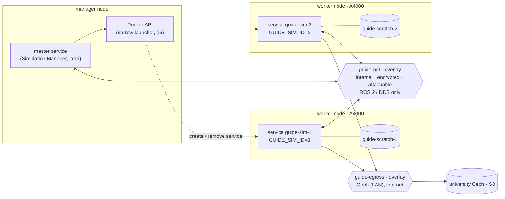
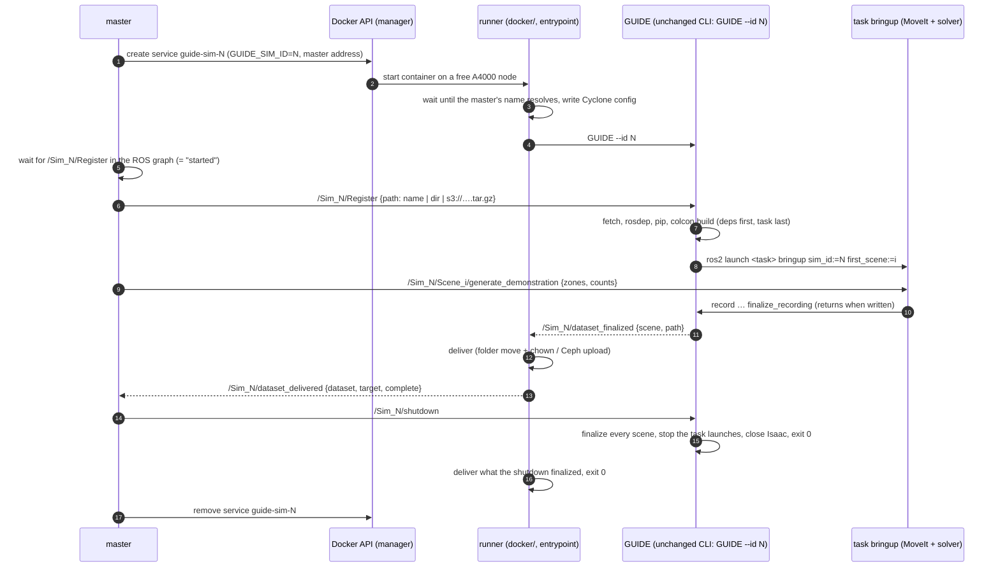
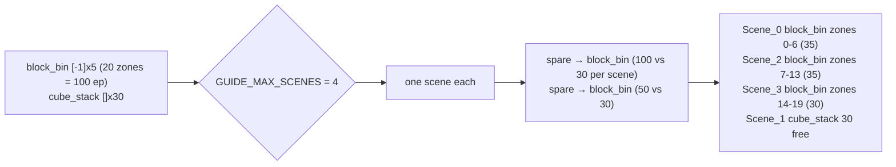
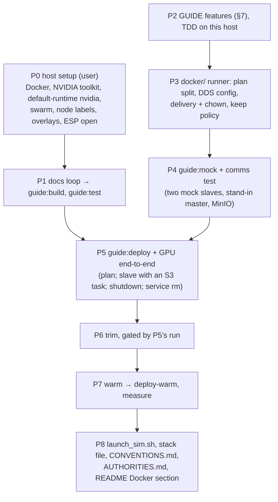

# GUIDE Docker images — design v4

Date: 2026-10-09 · Branch: `feat/docker` (from `dev` 834bb48) · Status: **draft for review**

| Version | Changes |
|---|---|
| v1 → v2 | the user's answers to the v1 questions |
| v2 → v3 | Swarm services. The sim id is set by whoever starts the container. `/Sim_N/shutdown`. Keep policy. Authorities record. |
| v3 → v4 | **GUIDE gets no container-only code.** <br>Every GUIDE change is a general feature that behaves the same outside Docker. <br>Container needs are met by configuration (an `init.yaml` the deployment provides, Kit `extra_args`) or by glue under `docker/`. <br>Dropped from GUIDE: `--set`, `--bringup`, `--tasks-dir`, `--max-scenes`, `--seed`, `num_zones`, stdout markers. <br>GitHub Actions: off. |

## 1. What we are building

GUIDE demonstration generation in containers on a Docker swarm.
- One container is one simulator (`Sim_<id>`) on one A4000, with several scenes.
- Several containers are several simulators, each with a unique id.
- A container either runs a plan by itself (automatic: id 0, exits when done) or is a
  slave that a master container (the future Simulation Manager) launches, commands over
  ROS 2 and shuts down.
- Datasets are recorded on a local volume and delivered per dataset to a mounted folder or
  the university Ceph (S3).
- ROS 2 traffic stays on the private overlay.

**GUIDE stays the same in and out of Docker.**
- GUIDE gets only general features (§7): each one is something a person running GUIDE by
  hand also uses, and behaves identically there.
- Everything container-specific is either configuration or lives under `docker/`, outside
  the GUIDE packages: entrypoint, runner (plan driving, delivery, DDS config), mock
  simulator, scripts.

Out of scope now: the master itself (its side of the interfaces is specified here), data
curation, a policy-testing image, CI/registry (images are built and run locally).

## 2. Topology



- **Two overlays per simulator.**
  - The DDS overlay is `--internal`: no gateway.
  - The normal `guide-egress` overlay gives Docker's gateway, so the container reaches Ceph
    and the internet.
  - Cyclone is pinned to the `guide-net` subnet, because the container has three interfaces.
- **Discovery is unicast.** A simulator's peers are itself and the master. A slave never
  learns of another slave; the master learns every slave from its discovery packets, which
  Cyclone answers even from unlisted peers.
- **No published ports.** Camera topics stay off, so camera data never leaves the container.
- **The encrypted overlay** needs ESP (IP protocol 50), 2377/tcp, 7946/tcp+udp and 4789/udp
  between nodes.

## 3. A slave's life, master-launched



**Nothing polls.**
- Both topics are pushed. They are transient-local, so late subscribers still get the history.
- Readiness is `Register` appearing in the ROS graph, which DDS discovery reports.

## 4. Plan mode (automatic; runner only)

Input is `GUIDE_PLAN` (a file or `s3://…`). Id 0 unless `GUIDE_SIM_ID` is set. The
container exits when done: 0 if every job got its counts.

```yaml
output: s3://guide-datasets/run-2026-10   # or a mounted folder; GUIDE_OUTPUT wins
jobs:
  - {task: block_bin, zones: [-1], counts: [5]}                # 5 in every zone
  - {task: s3://guide-tasks/cube_stack.tar.gz, counts: [30]}   # 30 free draws
```

**Splitting across scenes.** `GUIDE_MAX_SCENES` (a runner setting; default one scene per
job) caps the scenes the runner registers.
1. Each job gets one scene. More jobs than the cap is an error before Isaac starts.
2. Each job's first scene is registered, which installs the task. The runner then reads the
   job's zone count with guide_core's existing `zone_grid(<share>/config/randomize.yaml)`,
   the same call the solver uses. That turns `[-1]` into an explicit zone list.
3. Spare scenes go one at a time to the job with the most episodes per scene.
4. A job's work is dealt out by count: explicit zones as whole zones, free draws by
   splitting the count.



The runner plays the master's part locally: Register, generate (one dataset per scene,
under `/scratch/Sim_0/scene_<i>`), deliver each dataset when it is finalized. When all are
delivered it calls `/Sim_0/shutdown`, the same exit a master uses.

## 5. Slave mode

- **At start:** no tasks are loaded.
- **Register** fetches and builds the task with its dependencies, adds the scene and
  launches its bringup.
- **Capacity** is the master's business: it launched the simulator, so it knows how many
  scenes the simulator should hold.
- **Exit:** the container only exits on `/Sim_N/shutdown`, or on SIGTERM when the service
  is removed. Both take the same path.

## 6. Sim id and launching

The id is known before the container starts. The runner passes `GUIDE_SIM_ID` to GUIDE's
existing `--id` flag.

| Started by | How the id is set | Notes |
|---|---|---|
| **The master (recommended for slaves)** | it creates service `guide-sim-<id>` with `GUIDE_SIM_ID=<id>` (Docker Engine API) | The master picks the id. Readiness is `/Sim_<id>/Register` appearing. A restart keeps the id. A pending task means no capacity. |
| A fixed fleet (stack file) | `GUIDE_SIM_ID={{.Task.Slot}}` | 1…N, kept across restart and reschedule; scaling down may leave gaps. |
| A person | `GUIDE_SIM_ID=…` | |
| Nobody (automatic plan) | 0 | |

**What launching through the Docker API costs** (security record, §12):
- The Docker socket on a manager node is root on every node.
- Recommended with the master: a narrow launcher that builds the `guide-sim-<id>` spec
  itself and offers the master only `start(id)` / `stop(id)`.
- Until then, `docker/launch_sim.sh <id>` holds the reference spec.

**GPU placement.** Swarm services cannot take `--gpus` (swarmkit #1244 is still open).
- Every node gets `default-runtime: nvidia`; the image sets `NVIDIA_VISIBLE_DEVICES=all` and
  `NVIDIA_DRIVER_CAPABILITIES=all`.
- Services are placed by node label `guide.gpu=a4000` with `max_replicas_per_node: 1`.
- Generic resources are not used: they have known traps, and only multi-GPU nodes would
  need them.

## 7. GUIDE changes: general features only

Each change is used the same way without Docker. The last column says how.

| Change | Where | Outside Docker |
|---|---|---|
| **Register fetches, builds and launches the task.** A path may be an installed package, a directory, or `s3://….tar.gz`. Fetch first, before `stop()`, so the other scenes keep stepping. Then `rosdep`, `pip -c pins`, and `colcon --merge-install --packages-up-to <task>` into `~/.guide/tasks/install`, activated in GUIDE's own process. After `play()`, `ros2 launch <task> bringup.launch.py sim_id:=N first_scene:=<id> num_env:=1`. | `guide_ros.py`, new `guide_core/ros/task_bringup.py` | One `ros2 service call …/Register` replaces Register plus a separate task launch. README "Usage" loses the manual `ros2 launch <task> bringup.launch.py` step. |
| **Task launches take `sim_id` and `first_scene`** (no more hard-coded `Sim_0`) and remap `/clock` to `/Sim_N/clock` (`SetRemap`) | both `bringup.launch.py` | A second simulator on the same machine or domain |
| **`/Sim_N/clock`:** the clock graph is created in the simulator namespace | `guide_ros.py` | Simulators run at different speeds. `block_bin_eval` (own repo) remaps `/clock:=/Sim_0/clock`. |
| **`/Sim_N/shutdown`** (`std_srvs/Trigger`); Ctrl-C takes the same path: finalize every scene, stop the task launches, close Isaac (the existing, never-called `_cmd_shutdown`), exit 0 | `guide_ros.py` | Fixes Ctrl-C today: datasets get finalized but nothing ends Isaac's main loop |
| **`/Sim_N/dataset_finalized`** (`std_msgs/String` JSON `{scene, path}`, transient-local). `finalize_recording` now returns only once the recorder has written the dataset; `path` is empty if nothing was recorded. | `guide_ros.py`, `scene_recorder.py`, `scene_manager.py` | Any tool learns when a dataset is complete. Today the only signal is a log file line, written before the language columns. |

**Not GUIDE code; configuration instead:**
- **Render device and headless:** an `init.yaml` the deployment provides, mounted over the
  installed one. The image ships it with `render_device: cuda:0` and `headless: True`; a
  swarm config replaces it per deployment, e.g. on the dev host.
- **Crash reporter off and Kit log limits:** through `startup.extra_args`, which `SimulationApp`
  takes from the same `init.yaml`.

## 8. Task bundles (`.tar.gz`)

```
cube_stack.tar.gz
├── cube_stack/            exactly one task package: <pkg>/<pkg>/scene.py + package.xml
├── fr3_custom_moveit/     dependency packages (e.g. the robot's MoveIt config)
└── requirements.txt       optional: pip dependencies (installed with Isaac's pins)
```

- System dependencies come through rosdep from the `package.xml` files.
- No new message or service packages.
- The task package keeps the launch convention: `launch/bringup.launch.py` with `sim_id`,
  `first_scene`, `num_env`.
- Deferred: git dependencies (`deps.repos`).

## 9. Delivery, storage, failures (runner, `docker/`)

- **Scratch:** the named volume `guide-scratch-<id>` at `/scratch`, local to its node.
- **Folder target:** `<output>/Sim_<id>/<dataset>`, chowned to the folder's owner.
- **Ceph target:** `s3://bucket/prefix/Sim_<id>/<dataset>/…`
  - boto3 with path-style addressing;
  - endpoint from `AWS_ENDPOINT_URL`;
  - credentials in the swarm secret `guide_s3` (`AWS_SHARED_CREDENTIALS_FILE=/run/secrets/guide_s3`);
  - the scratch copy is deleted only after every file is uploaded.
- **Keep policy:** nothing is deleted unless delivered.
  - Short datasets are delivered marked `complete: false`.
  - A failed upload stays in scratch (`target: null`).
  - After a crash, swarm restarts the container with the same id and volume; the unfinished
    dataset is left untouched.
  - Deferred: top-ups, resume, upload retries.
- **`.gitignore`** gets `docker/secrets/` and `*.env`.

## 10. Images, built and run locally

| Image | Built from | Purpose |
|---|---|---|
| `guide:build` / `guide:test` | `ros:jazzy-ros-base` + README "Prerequisites" and "Installation" blocks run verbatim | docs loop; pytest without a GPU |
| `guide:deploy` | `base` + trimmed `.venv` + `install/` + `docker/` glue | data generation |
| `guide:deploy-warm` | `docker commit` after `docker/warm.sh` on an A4000 | what nodes run (same NVIDIA driver on every node) |
| `guide:mock` | `ros:jazzy-ros-core` + `guide_msgs` + runner + mock simulator | communication tests, no GPU |

**Docs loop.**
- A build failure is fixed in README/INSTALLATION, never worked around in the Dockerfile.
- Done: `franka_ros2` tracks its `COLCON_IGNORE`s (aa5fd9d; the user pushes it).
- Known next: `lerobot[dataset]`; `isaacsim[all]` vs the subset; `RMW_IMPLEMENTATION`;
  `psmisc`; INSTALLATION §6.2.
- GUIDE comes from the build context, because `origin/dev` lags local `dev` by 116 commits.

**Trim.** Each cut is gated by the GPU end-to-end run:
- from the ROS workspace only `install/` plus the DDS config;
- the isaacsim subset;
- unused Kit extensions (about 8.8 GB) and their test/doc folders (about 1.2 GB);
- torch cu130 only;
- no training extras;
- exact apt list with `--no-install-recommends`;
- stripped `.so` files.

**Deferred: GitHub Actions** (off for now). If it is turned on, three findings apply:
- Docker's data root must move to `/mnt` (the build peaks at 45–55 GB);
- the venv must be split into layers under GHCR's 10 GB per-layer limit;
- warming must stay on a self-hosted A4000 node.

## 11. Conventions (become `docker/CONVENTIONS.md`)

| What | Convention |
|---|---|
| Namespaces | `/Sim_<id>`; scenes `/Sim_<id>/Scene_<i>`; clock `/Sim_<id>/clock` |
| GUIDE interface | `/Sim_<id>/Register`, `/Sim_<id>/shutdown` (`std_srvs/Trigger`), `/Sim_<id>/dataset_finalized` (topic), `/Sim_<id>/Scene_<i>/generate_demonstration` |
| Runner topic | `/Sim_<id>/dataset_delivered`: `std_msgs/String` JSON `{dataset, target, complete}`, transient-local |
| Task launch | `<task>/launch/bringup.launch.py` with `sim_id`, `first_scene`, `num_env` |
| Environment (runner) | `GUIDE_SIM_ID`, `GUIDE_PLAN`, `GUIDE_OUTPUT`, `GUIDE_MAX_SCENES`, `GUIDE_MASTER` (name or VIP), `AWS_ENDPOINT_URL`, `AWS_SHARED_CREDENTIALS_FILE` |
| Config | swarm config `guide_init` → the installed `guide_core/config/init.yaml` |
| Services | `guide-sim-<id>`, `guide-master`; label `guide.gpu=a4000`, `max_replicas_per_node: 1`, stop grace 180 s, restart on failure |
| Networks | `guide-net` 10.42.0.0/24 (internal, encrypted, attachable; DDS only), `guide-egress` (attachable) |
| Volume / secret | `guide-scratch-<id>` → `/scratch`; `guide_s3` → `/run/secrets/guide_s3` |
| Output | `<output>/Sim_<id>/<dataset>` |
| Task bundle | `.tar.gz` as in §8; tasks build into `~/.guide/tasks` |
| Images | `guide:<version>-{test,deploy,deploy-warm,mock}`, local; base images pinned by digest |
| Paths | `/root/ros2_ws/.venv`, `/root/ros2_ws/install` |

## 12. Authorities (security record, becomes `docker/AUTHORITIES.md`)

| Holder | Authority | Why | Risk | Limited by |
|---|---|---|---|---|
| Simulator container | runs as root | Register runs `rosdep` (apt) for task dependencies | an escape from the container is root on the node | no `--privileged`, no host mounts except the output folder, default seccomp/AppArmor, no Docker socket |
| Anyone who can reach `Register` (in Docker: `guide-net`; locally: the ROS domain) | downloads and **executes** task code (colcon/setup.py, launch files, pip, apt) | Register builds and launches tasks | reaching `Register` means code execution as GUIDE's user | `guide-net` internal and encrypted, GUIDE services only; later SROS2 |
| Same | calls `generate_demonstration`, `shutdown` | master control | a stray peer can stop or occupy a simulator | as above |
| Task code (incl. downloaded) | reads `/run/secrets/guide_s3`, reaches Ceph and the internet | delivery, assets, dependencies | credential theft, exfiltration | Ceph key scoped to write-only on one bucket/prefix |
| Runner | `chown`s delivered datasets to the output folder's owner | host users manage their data without `sudo` | none beyond root's | only the delivered dataset folder |
| Container | all GPU capabilities | Isaac renders (graphics, NVENC) | driver attack surface | A4000 nodes only |
| Master / launcher | Docker socket on a manager | create/remove `guide-sim-<id>` | root on every node of the swarm | narrow launcher (`start(id)`, `stop(id)`) instead of the socket in the master |
| `docker` group members | control the Docker daemon | operating the swarm | root-equivalent on that host | keep the group small |
| Image | contains NVIDIA Isaac Sim; EULA accepted via `OMNI_KIT_ACCEPT_EULA=YES` | headless start | the team accepts NVIDIA's EULA for each deployment | images stay local / private |
| Kit | crash reporter off (`init.yaml` `extra_args`) | — | (removed: crash dumps to NVIDIA) | configuration |

**Deferred hardening: running without root** (decided 2026-10-09: keep root for now). Root is
needed only because Register runs `rosdep install` (apt). Dropping it takes:
1. Register runs `rosdep check` instead and fails with the missing system packages. That is
   the same rule outside Docker. A task's system packages then come with the image, or with
   a task image built `FROM guide:deploy`.
2. Build and run as `guide` (uid 1000): `sudo` only for the build's apt block, none in deploy;
   workspace `/home/guide/ros2_ws`.
3. `guide` owns the venv (pip, Kit's cache and logs), `~/.guide/tasks`, `~/.ros` and
   `/scratch`. A new named volume inherits the image's ownership.
4. Host output folders belong to uid 1000 (or a shared group). The `chown` and its row
   above go away.
5. The secret is mounted with `uid=1000,mode=0400`.
6. The service spec sets `--user 1000:1000`.

Cost: a task that needs a new system package needs an image update. Not options with swarm:
rootless Docker (no overlay networks); `userns-remap` (daemon-wide, untested with the NVIDIA
runtime). Later still: a read-only root filesystem and `--cap-drop ALL`.

## 13. Build order



P2 and P3 can start now. The Docker phases need P0.
